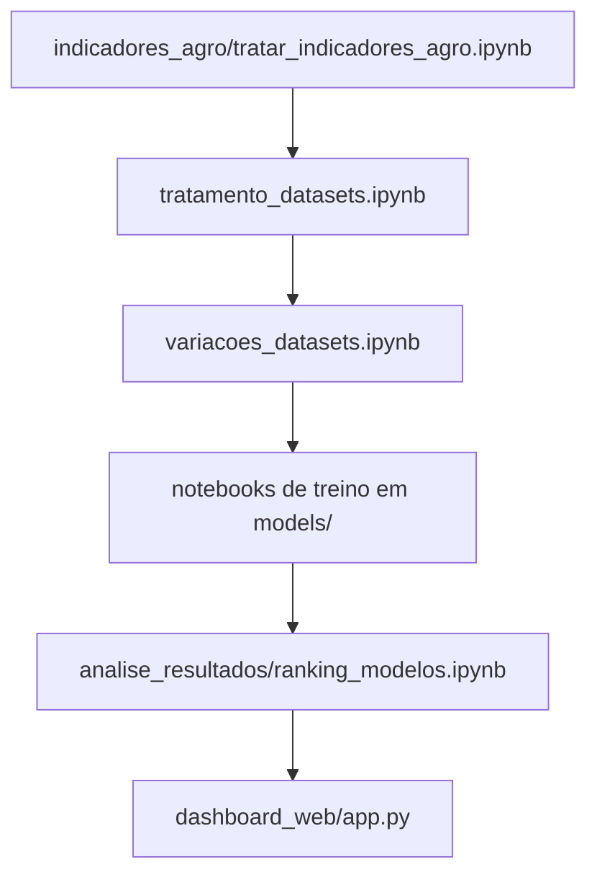

# Analise comparativa de modelos de machine learning - Agro Brasil

Este repositorio organiza um fluxo completo de estudo para comparar modelos de machine learning aplicados a ativos do agronegocio. O projeto esta estruturado em notebooks de preparo de dados, treinamento de modelos, consolidacao dos resultados e uma interface web para visualizacao dos rankings e metricas.

## Visao geral

O projeto trabalha com os ativos `AGRO3`, `SLCE3` e `SOJA3` e compara estrategias de regressao e classificacao em diferentes configuracoes de dataset:

- `dataset_base`
- `dataset_dummy`
- `dataset_indicadores`
- `dataset_janelas`

Os experimentos geram saidas consolidadas em `analise_resultados/`, que depois sao consumidas pelo dashboard web.



## Estrutura do projeto

- `datasets/`: notebooks e arquivos de entrada/saida da preparacao de dados.
- `models/`: notebooks de treinamento por familia de modelo, dataset e ticker.
- `analise_resultados/`: consolidacao, analise e ranking dos resultados.
- `dashboard_web/`: aplicacao Flask para navegar pelos resultados.

## Ordem correta de execucao

Para ver o projeto completo funcionando, siga esta ordem. Os passos anteriores geram arquivos que sao usados pelos passos seguintes.

1. `datasets/indicadores_agro/tratar_indicadores_agro.ipynb`

   Prepara os indicadores agro e gera os lags de fechamento usados no restante do pipeline.

2. `datasets/tratamento_datasets.ipynb`

   Monta os datasets base de regressao e classificacao a partir dos dados tratados e integra os indicadores agro nos experimentos.

3. `datasets/variacoes_datasets.ipynb`

   Deriva as variacoes de entrada usadas nos experimentos, como `dataset_dummy`, `dataset_indicadores` e `dataset_janelas`.

4. Notebooks de treino em `models/`

   Execute os notebooks de cada familia de modelo conforme o experimento desejado. O repositorio esta organizado por:

   - `regressao_linear`
   - `regressao_linear_rede_neural`
   - `regressao_logistica`
   - `random_forest`
   - `xgboost`
   - `classificacao_rede_neural`

   Dentro de cada familia, os notebooks sao separados por tipo de dataset e ticker. Eles geram os CSVs de metricas que alimentam a consolidacao final.

5. `analise_resultados/ranking_modelos.ipynb`

   Consolida os resultados de todos os modelos e grava os arquivos finais `consolidado_regressao.csv` e `consolidado_classificacao.csv` em `analise_resultados/`.

6. `dashboard_web/`

   A aplicacao web le os CSVs consolidados e exibe filtros, tabelas, ranking, heatmap, evolucao por horizonte, box plot, resumo estatistico e o melhor modelo por cenario.

## Como executar

### 1. Instalar dependencias

Crie e ative um ambiente virtual, se desejar, e instale as dependencias:

```bash
pip install -r requirements.txt
```

### 2. Rodar os notebooks na ordem

Abra os notebooks no VS Code ou Jupyter e execute na sequencia descrita acima. Sem essa ordem, os arquivos intermediarios podem nao existir e os passos seguintes nao vao conseguir carregar os dados.

### 3. Gerar os resultados finais

Depois de treinar os modelos e executar o notebook de consolidacao, confirme que os arquivos abaixo existem em `analise_resultados/`:

- `consolidado_regressao.csv`
- `consolidado_classificacao.csv`

### 4. Abrir o dashboard web

O dashboard depende dos CSVs consolidados. Para iniciar a aplicacao:

```bash
cd dashboard_web
flask --app app run --debug
```

Se preferir, voce tambem pode executar:

```bash
python app.py
```

Por padrao, o login usa a senha `ine5660`. Para alterar, defina a variavel de ambiente `DASHBOARD_WEB_PASSWORD`. A chave de sessao pode ser trocada com `DASHBOARD_WEB_SECRET_KEY`.

## Dashboard web

A aplicacao web foi criada para explorar os resultados sem abrir os notebooks. Ela oferece:

- filtro por tipo de problema, modelo, dataset, ticker, horizonte e metrica
- tabela principal e tabela detalhada
- grafico de ranking
- heatmap por horizonte
- evolucao da metrica por ticker
- box plot dos resultados
- resumo estatistico por modelo e por estrategia de dataset
- melhor modelo por cenario

O dashboard e util principalmente depois que todo o pipeline de notebooks foi executado, porque ele depende diretamente dos CSVs consolidados gerados na etapa final.

## Observacoes

- O projeto e orientado a notebooks, nao a scripts unicos.
- Se algum arquivo intermediario nao existir, volte uma etapa no fluxo e reexecute o notebook anterior.
- O dashboard web nao cria os resultados por conta propria; ele apenas visualiza o que foi consolidado em `analise_resultados/`.